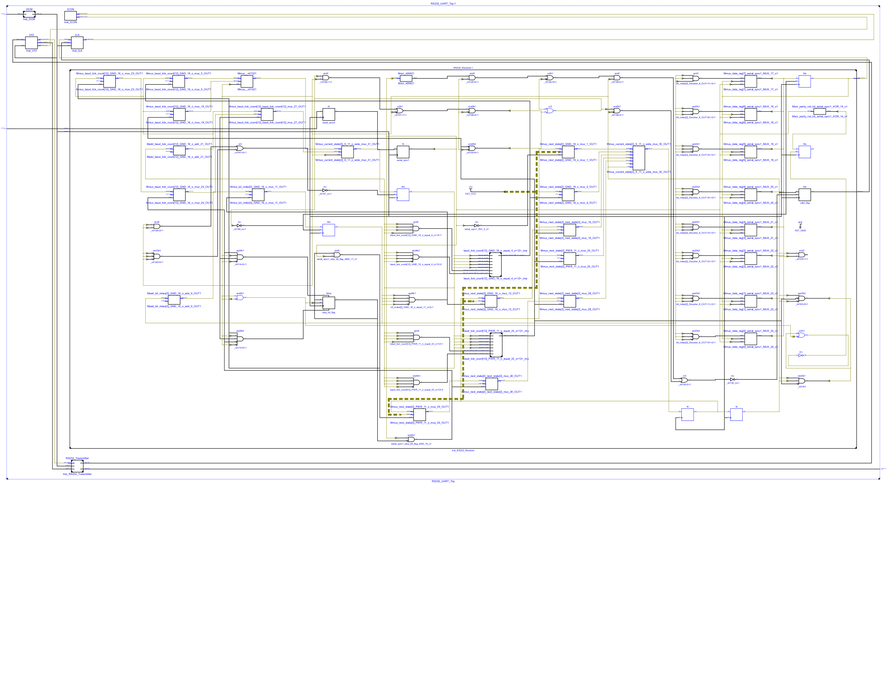
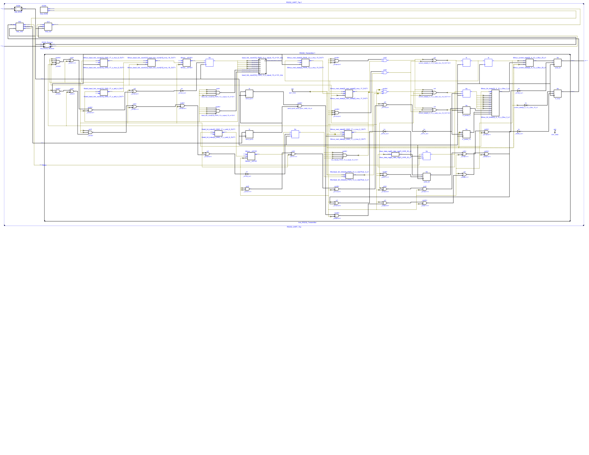
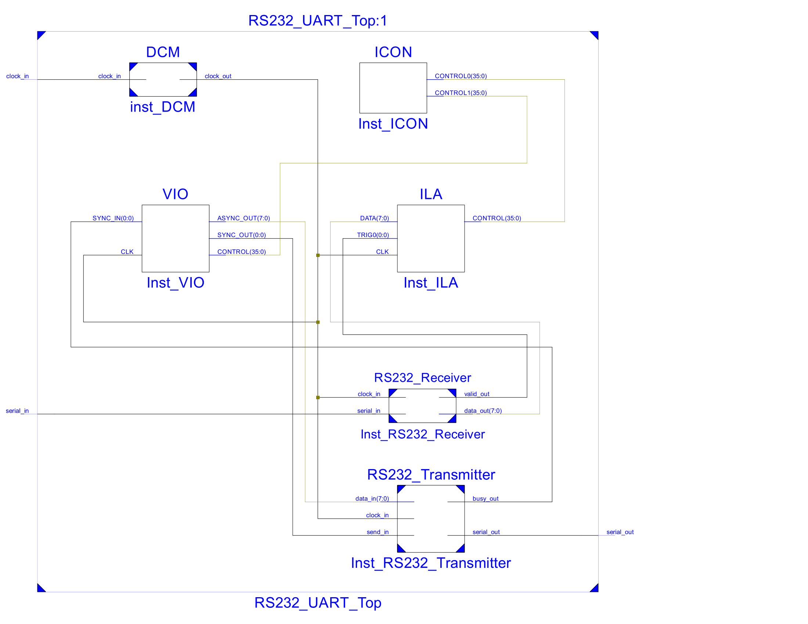

# RS232 UART Communication System on FPGA
### FSM-Based Transmitter & Receiver + DCM + ILA/VIO/ICON Debugging (VHDL)

This project implements a **complete RS232 UART communication system** on FPGA using **VHDL**.  
It includes FSM-based transmitter and receiver, parity support, clock management via DCM, and real-time debugging using **ILA, VIO, and ICON** cores.

---

## ✨ Features
- 8-bit UART TX/RX (LSB-first)
- Even-parity support (TX generation + RX checking)
- FSM-based transmitter and receiver
- Stop-bit validation
- Clock management via DCM
- Real-time debugging with ILA, VIO, ICON

---

## 📡 UART Packet Format
start(0) | 8 Data Bits | Parity | Stop(1) | Stop(1)

---

## 🖼️ RTL View

---

## 🧠 Author
**Mohammad Goodarzi**  
Computer Engineering – FPGA & Computer Architecture Enthusiast

---

## 📜 License
MIT License
